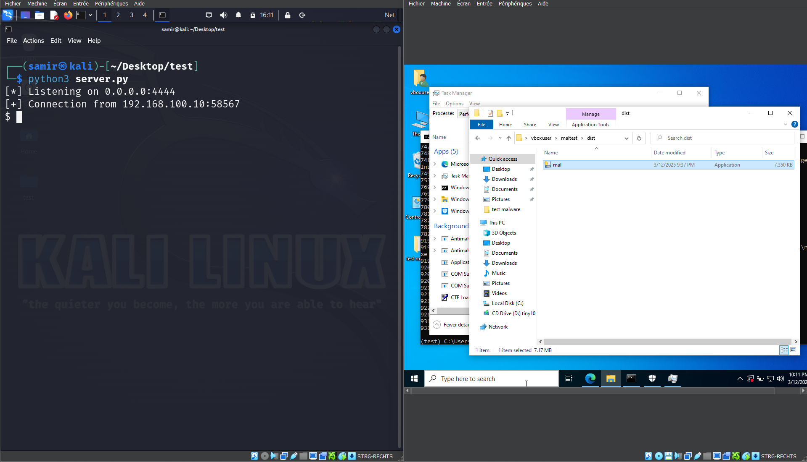
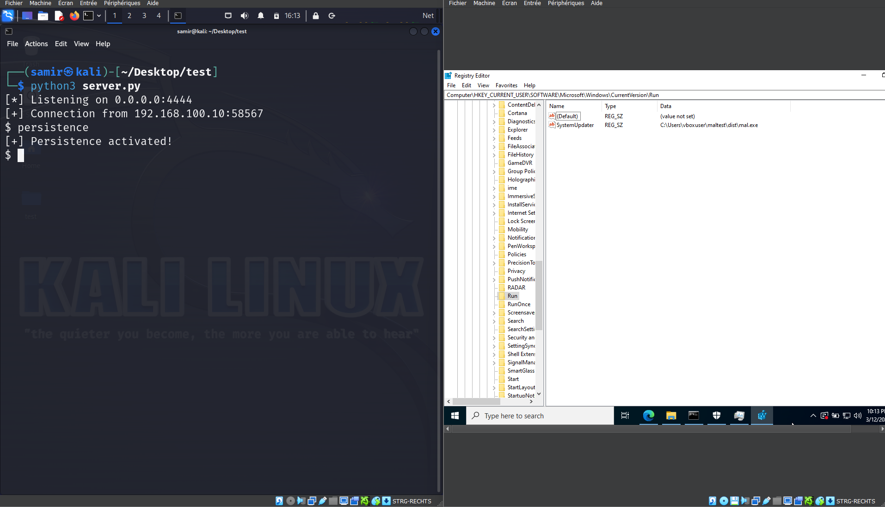
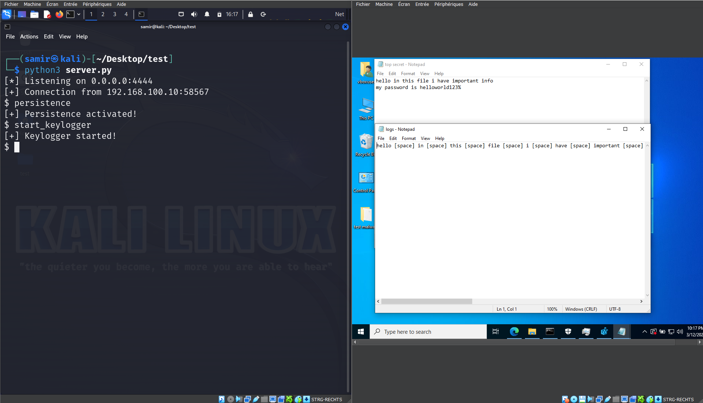
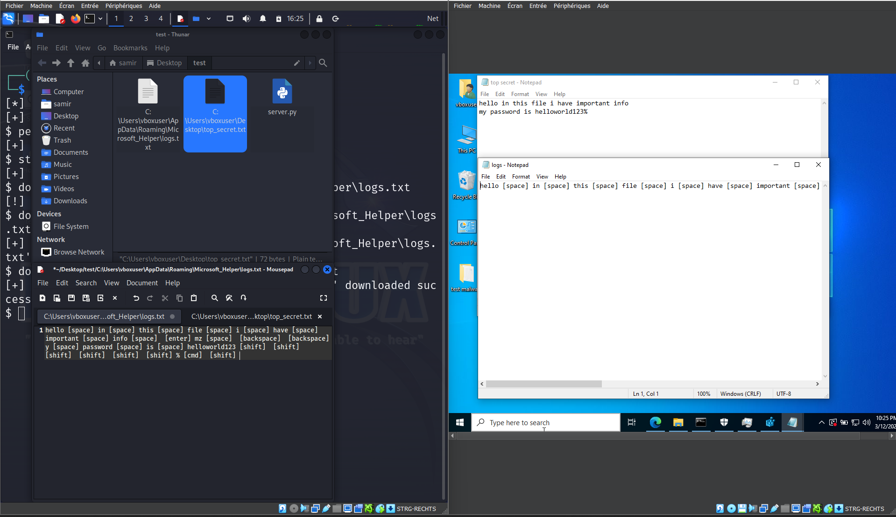
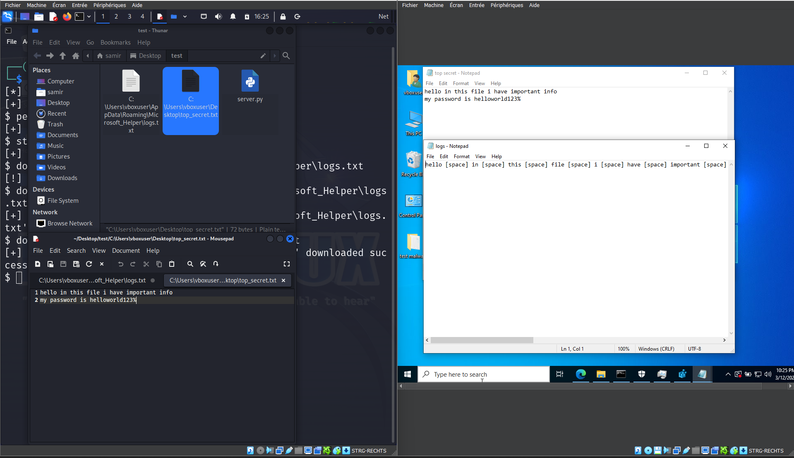

# Remote Access Trojan (RAT) & Keylogger Demonstration  
**Educational Cybersecurity Demo**  

---

## 📋 Table of Contents  
1. [Explanation](#-explanation)  
2. [Requirements](#-requirements)  
3. [Tutorial](#-tutorial)  
4. [Screenshots](#-screenshots)  
5. [Additional Resources](#-additional-resources)  

---

## 🧠 Explanation  
This demo simulates a cyberattack with:  
- **Keylogging** to capture sensitive inputs  
- **Persistence** via Windows Registry  
- **Remote Command Execution**  
- **File Exfiltration**  

**Key Risks**:  
- Data theft without admin privileges  
- Long-term system compromise  
- Hidden malware storage  

---

## ⚙️ Requirements  

### Attacker (Kali Linux):  
- Python 3.10+  
- Open port `4444`  

### Victim (Windows):  
- Python 3.10+  
- Libraries: `pynput`  
- or just compiling one time the client.py with pyinstaller with the following command (`pyinstaller --onefile --noconsole --hidden-import=pynput trojan_client.py`)

---

## 🛠️ Tutorial  

### 1. Start Listener  
Run the server script:  
`python3 server.py`  

### 2. Deploy Payload  
Execute the client script:  
`python client.py` or the executable from pyinstaller  

### 3. Key Commands  
- **Activate Persistence**: `persistence`  
- **Start Keylogger**: `start_keylogger`  
- **Steal Files**: `download C:\path\to\file` 
- **any windows command** :`ipconfig, whoami ...` 

---

## 📸 Screenshots  
| Description | Image |  
|-------------|-------|  
| Server Active |  |  
| Registry Entry |  |  
| Keylog File |  |  
| Download Files  |       |
| windows command |  | 

---

## 📚 Additional Resources  
- [MITRE ATT&CK Framework](https://attack.mitre.org/)  
- [PyInstaller Guide](https://pyinstaller.org)  

---

